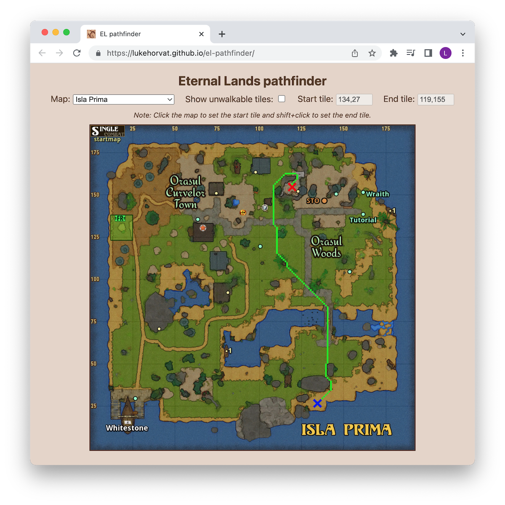

# el-pathfinder

An implementation of a pathfinder for Eternal Lands maps.

It uses an A\* search algorithm with an "octile distance" cost heuristic to find the optimal path between two points on a map.

Live demo [here](https://lukehorvat.github.io/el-pathfinder/).

